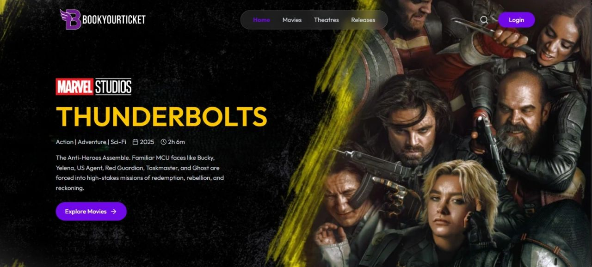
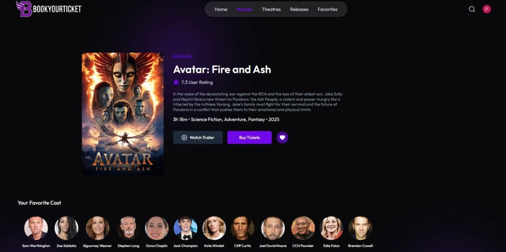
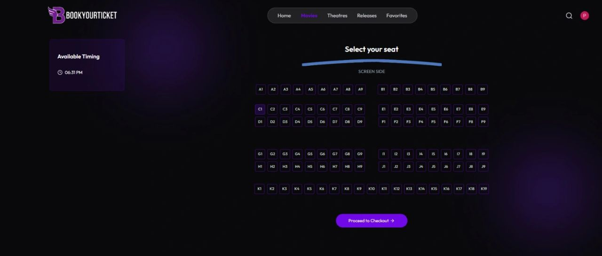
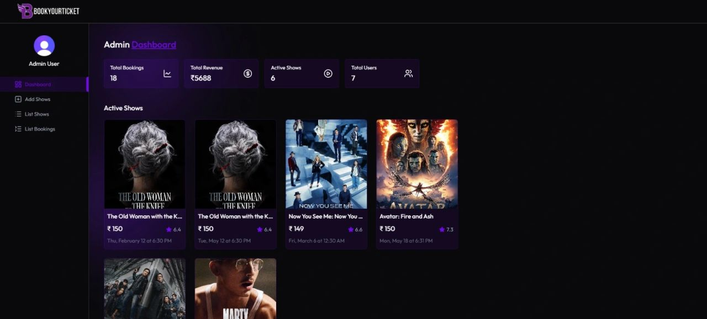

## 🎬 Movie Ticket Booking System

A full-stack Movie Ticket Booking Web Application where users can explore movies, view show timings, select seats, and book tickets seamlessly in real time.

## 🚀 Live Demo

🔗 GitHub Repository:  
[Movie Ticket Project Repository](https://github.com/PIYUSHSRI053/Movie-Ticket-Project?utm_source=chatgpt.com)

## 📸 Project Preview






---

# ✨ Features

* 🎥 Browse latest movies
* 🔍 Search movies easily
* 🪑 Real-time seat selection
* 🎟️ Ticket booking system
* 🔐 User Authentication & Authorization
* 📱 Fully Responsive UI
* ⚡ Fast and smooth performance
* 🛠️ Admin Dashboard for movie management

---

# 🛠️ Tech Stack

## Frontend

* React.js
* HTML5
* CSS3
* JavaScript

## Backend

* Node.js
* Express.js

## Database

* MongoDB

## Tools & Libraries

* JWT Authentication
* Axios
* Redux / Context API
* Mongoose

---

# 📂 Folder Structure

```bash
Movie-Ticket-Project/
│
├── client/
│   ├── src/
│   └── public/
│
├── server/
│
├── screenshots/
│
├── package.json
└── README.md
```

---

# ⚙️ Installation & Setup

## 1️⃣ Clone Repository

```bash
git clone https://github.com/PIYUSHSRI053/Movie-Ticket-Project.git
```

## 2️⃣ Move into Project Folder

```bash
cd Movie-Ticket-Project
```

## 3️⃣ Install Dependencies

### Frontend

```bash
cd client
npm install
```

### Backend

```bash
cd server
npm install
```

---

# ▶️ Run Project

## Start Frontend

```bash
npm start
```

## Start Backend

```bash
npm run server
```

---

# 🔑 Environment Variables

Create a `.env` file inside the server folder and add:

```env
PORT=5000
MONGO_URI=your_mongodb_connection
JWT_SECRET=your_secret_key
```

---

# 📌 Future Improvements

* 💳 Online Payment Integration
* 🎭 Movie Recommendation System
* ⭐ User Reviews & Ratings
* 📧 Email Ticket Confirmation
* 📊 Booking Analytics Dashboard

---

# 👨‍💻 Author

## Piyush Srivastava

* GitHub: [PIYUSHSRI053 GitHub](https://github.com/PIYUSHSRI053?utm_source=chatgpt.com)
* LinkedIn: [Piyush Srivastava LinkedIn](https://www.linkedin.com/in/piyush-srivastava-001b59293/?utm_source=chatgpt.com)

---

# ⭐ Support

If you liked this project:

* ⭐ Star the repository
* 🍴 Fork the project
* 📢 Share with others

---

# 📜 License

This project is licensed under the MIT License.

```

This README gives your project:
- Professional GitHub look
- Better recruiter impression
- ATS-friendly keywords
- Cleaner structure
- Strong portfolio presentation

:contentReference[oaicite:4]{index=4}
::contentReference[oaicite:5]{index=5}
```
